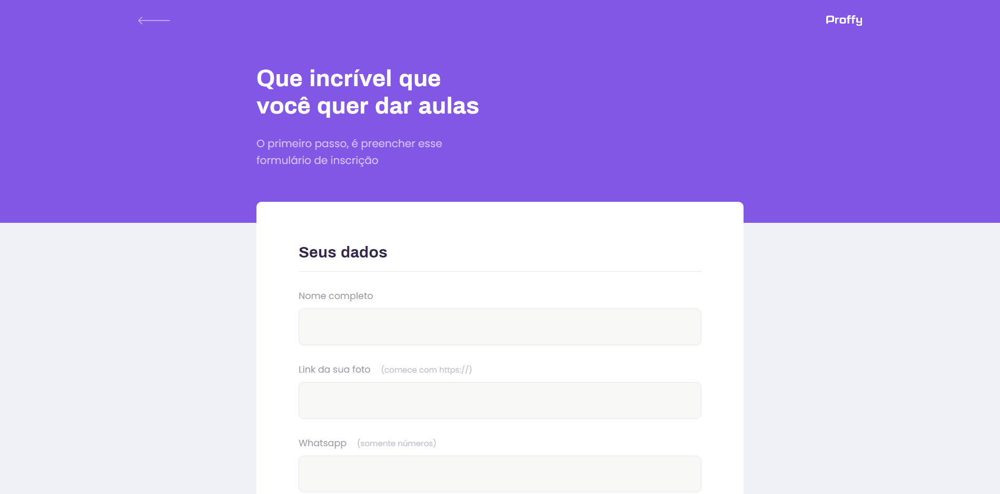

<p align="center">  </p>

---

<br>

## 📖 Sobre o projeto

A **Proffy** é uma plataforma feita para unir estudantes que precisam de aulas e professores que podem ajudar, montando o horário que possuem disponível e a taxa cobrada. Foi idealizada pela [Rocketseat](https://www.rocketseat.com.br/) durante a NLW (Next Level Week) #02.

<br>

<p align="center">  </p>

---

<br>

## Tecnologias utilizadas

* HTML
* CSS
* JavaScript
* Typescript
* React
* Node.js
* Nunjucks
* SQLite

<br>

---

<br>

## 🚀 Como executar o projeto

Antes de começar, você vai precisar ter instalado em sua máquina as seguintes ferramentas:
[Git](https://git-scm.com), [Node.js](https://nodejs.org/en/). 
Além disto ter um editor para trabalhar com o código como [VSCode](https://code.visualstudio.com/).

#### 🧭 Rodando a aplicação

```bash
# Download do repositório
git clone https://github.com/magaliais/proffy

# Entrar no diretório
cd proffy

# Baixar as dependências
npm install

# Executar a aplicação
npm start

# Executar o servidor
npm run dev

# Abra o browser em
https://localhost:5500

# É possível visualizar a plataforma remotamente em outro dispositivo conectado à mesma rede por meio de:
SEUIPv4:5500
```

<br>

---

<br>

## 💪 Como contribuir para o projeto

1. Faça um **fork** do projeto.
2. Crie uma nova branch com as suas alterações: `git checkout -b my-feature`
3. Salve as alterações e crie uma mensagem de commit contando o que você fez: `git commit -m "feature: My new feature"`
4. Envie as suas alterações: `git push origin my-feature`

<br>

---

<br>

##  Preview

<br>

* ### Página Inicial

<br>

<p align="center">  </p>

<br><br>

* ### Busca por aula

<br>

<p align="center">  </p>

<br><br>

* ### Cadastro do professor

<br>

<p align="center">  </p>

---

Feito com 💜 by Rocketseat :wave: Participe da nossa comunidade no [Discord!](https://discordapp.com/invite/gCRAFhc)
